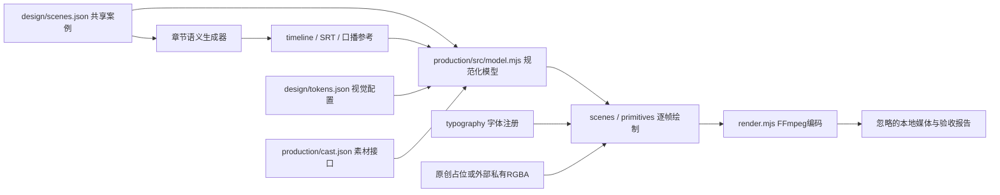

# 架构与扩展边界

当前项目是一套有限教学案例的制作管线：一份共享案例、可审查的语义时间轴、两类静帧模板、第一章六节渲染器，以及单独的编码/交付步骤。目录按内容、设计、字体、素材、渲染与验证划分；根package/lockfile和Python虚拟环境只有一套。新章节脚手架生成内容原型，尚不能把任意章节自动变成完整影片。

## 数据流和依赖



读取方向是内容/配置 → 校验与规范化 → 场景/绘制 → 编码与交付。QA从各层读取结果，不把机器报告、编码媒体或字体缓存作为内容源。默认QA只在临时目录重建跟踪产物并比较；显式build才写回。

| 层 | 实际入口和规则 |
| --- | --- |
| 共享案例 | `design/scenes.json`唯一维护名字、策略、矩阵、默认选择。Python `case_data.py`与Node验证/模型读取同一文件，不能各自复制常量。 |
| 内容 | 章节生成器维护语义块、参考发声窗和停顿。派生timeline/SRT/录音稿提交供审查，重建必须确定且只读QA相等。 |
| 模型 | `production/src/model.mjs`验证案例、timeline和production Schema，再补齐CAST姓名、content矩阵、TOKENS颜色/字幕。此层不导入场景、字体、私有图层或FFmpeg。 |
| 渲染 | `scenes.mjs`组织六节，`primitives.mjs`绘制可测量的文字/图形，`choreography.mjs`提供显式时间动作，`character_adapter.mjs`适配角色槽位。状态依赖传入时间，不读墙钟驱动动画。 |
| 纯计算/元素 | `motion.mjs`由实际文字出入场、标题/定义、动作和rig消费；`elements/`通过显式资源/API注入复用卡牌、矩阵和字幕；`character-layers.mjs`定义prepared空间。接口及限制见[可复用绘制接口](render-elements.md)。 |
| 素材/字体 | 原创SVG与私有RGBA通过明确模式进入绘制；缺私有层不静默替换。`production/typography/fonts.mjs`仅保留旧导入兼容入口，重新导出根字体注册器。 |
| 编码/交付 | `render.mjs`处理逐帧输出与FFmpeg流；文本导出、源码归档、音效、联系图各有命令。编码失败不代表内容Schema失败，完整解码也不代表音频对齐成功。 |
| 验证/工具 | `scripts/`目前同时包含命令入口和小共享库（case、schema、layout、Python路径）；`tests/`提供独立负例和变异。保留现有路径，新增模块优先按单一职责命名，出现实际复用需求再拆库。 |

静帧`design/render-proposals.mjs`直接消费共享案例/视觉配置，有自己的固定布局；它不读取整集输出。`production/tokens.json`只声明整集几何/动作/编码与共享来源，颜色和字幕在模型层从根tokens补齐。prototype与production的布局不同，不应为目录统一而强合成一个渲染器。

## 当前有限扩展合同

- 可改A/B显示名、red/blue策略显示名、0–99整数收益、四种默认选择及支持的文字/色彩/字号；实际字形边界和碰撞仍须通过。合法更章的真实build+QA已进入`test:case-reuse`。
- `chapter:new`仅创建两段原创内容、元数据和人工参考timeline；整集模型明确绑定第一章及六节顺序。新章完整视频需要新增场景映射/动作、转场与影片验收，不能只新增JSON就宣称支持。
- 更多参与者、第三策略、负数/小数、任意布局、自动配音对齐、通用章节动画编排均未实现；先定义对应Schema与独立验收，再扩展消费者。
- 工程版本、Schema版本、章节contentVersion和验收source commit分开记录；一次视觉通过不能自动迁移到新源码。

## 源码包与开发工作区

Git checkout是受支持的开发入口。`qa:source`、复用/字体变异夹具和`pack:source`使用Git候选文件清单；公开ZIP不包含`.git`，不承诺解压后可直接运行完整`npm test`。要开发或安装，请按README克隆评审分支。

公开ZIP是文本源码归档。其`SOURCE_MANIFEST.json`同时记录实际HEAD、工作区是否有非忽略差异、是否可按该commit复现源码、分发类型、工程/Schema/章节版本及每文件散列。dirty或无HEAD时`reproducible_from_commit=false`，文件散列描述打包时的具体字节；忽略的字体/私有图层/媒体不属于此记录。打包期间源码变化则保留旧ZIP并失败。

干净解压目录可直接运行，不需要Git、npm或fontTools：

```sh
python3 production/verify_source_archive.py
```

该命令核对列明文件字节和公开边界，拒绝缺失、修改、符号链接及未列明文件；检查必须在安装依赖或生成产物之前执行。已实际解压验证并运行两次，未初始化Git；新增/篡改文件负例非零。清单散列提供完整性依据，不是发行者签名、依赖安装或影片验收。

## 分开记录交付证据

| 证据层 | 必须绑定 | 可建立的结论 |
| --- | --- | --- |
| 源码验证 | 当前commit、环境、命令、CI run；源码包另记录dirty与manifest版本 | 安装/Schema/语义/负例/发布边界在指定输入上通过 |
| 原创占位渲染 | 同一源码、字体指纹、配置、采样时点/平台 | 数值/字形/布局/确定性与占位资产通过；不覆盖私有角色像素 |
| 私有角色视觉影片 | 实际source commit、素材/媒体指纹、全解码、抽帧与图文净空报告 | 指定素材和影片的视觉验收；没有音轨时继续标视觉预览 |
| 完整视听交付 | 真实音轨、字幕重对齐、完整试听、平台播放和编码结果 | 最终视听成片验收 |

具体步骤见[工程契约](project-structure.md)与[交付检查单](delivery-checklist.md)。新增架构应有实际扩展用途和上述层级的回归，不引入只改变目录外观的迁移。
